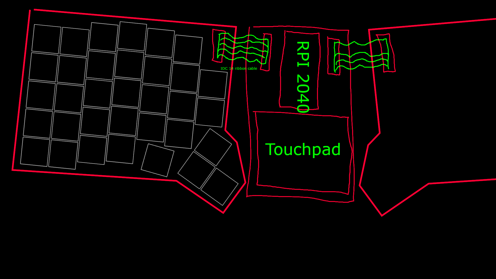
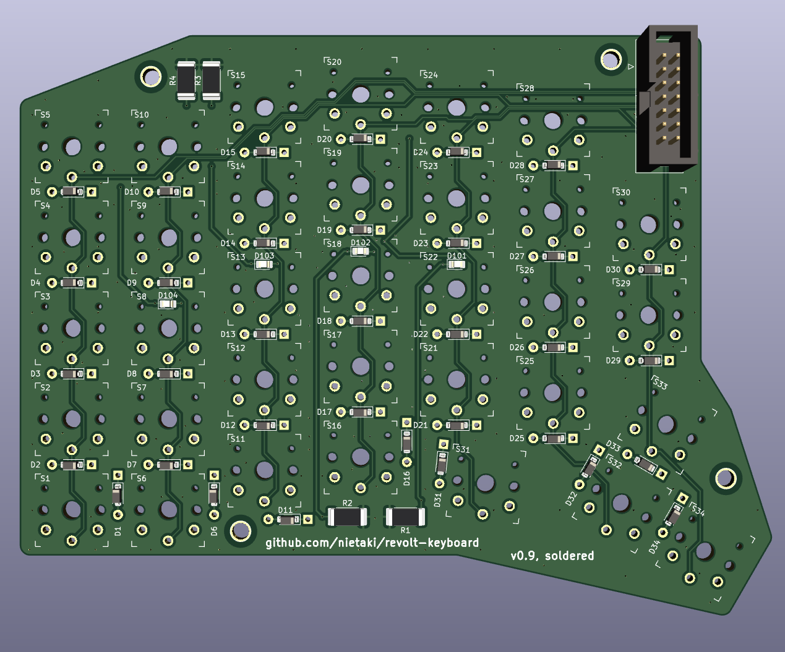
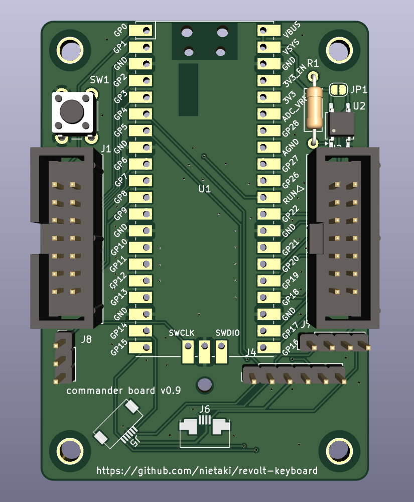

# Revolt Keyboard

> **Revolt** - a split ergonomic keyboard prioritising ease of adoption, flexibilty, easy build+repair, and partial upgrades
> 

## Why call it “Revolt”?

1. It’s heavily inspired by [Redox](https://github.com/mattdibi/redox-keyboard), an amazing open-source keyboard, that is still my daily driver
2. It’s revolting against the popular design philosophy of keybords like Sofle, Lily58 or Corne, which prioritise a compact footprint over other qualities
3. Some might find it “revolting”, since its looks are secondary to its features

More info on the design philosophy behind revolt in the [Revolt Manifesto](./Revolt_Manifesto.md)

## TL;DR

It’s (going to be) a 68 key, wired, choc-based split ergonomic keyboard running QMK. Instead of being split into 2 halves, it’s split into 3 parts: left input, right input and the center one called “commander”

The left and right input parts are “dumb”, and contain only the switches and diodes to make 7x5 matrix work, plus optional LEDs under home keys.

The case will be made with low profile + tenting in mind (with multiple tenting angles possible), with two versions: for soldered switches without a top plate and hotswap with a top plate.

The commander board should lend itself to experimenting with different pointing devices. The first iteration has connectors for an [Azoteq TPS43 touchpad](https://www.digikey.com/en/products/detail/azoteq-pty-ltd/TPS43-201A-S/7164940?s=N4IgTCBcDaIC4AcDOAWAzCAugXyA) and a PSP 3000 joystick. It should be easy to create versions that support other pointing devises, like a trackball, a Cirque touchpad or other joysticks.

## FAQ

### Why do you hate Sofle/Lily58/Corne?

I don’t! They’re beautiful keyboards, designed with love and forethought, all of them with passionate communities. They just don’t fit the criteria of what I’m looking for in an ergonomic keyboard that can be used just as easily for programming and gaming, especially for people coming from “regular” keyboards. I wanted to make a keyboard that’s perfect for me and other like-minded people.

### No wireless version?

I’m not ruling out a wireless version in the future. I’d like to perfect the wired version to my liking and see what kinds of compromises make sense.

But with Revolt being open source, there’s no reason for anyone interested not to take a crack at it themselves.

## TODO

### Input PCB

- [x] ERC, DRC rules from JLC
- [x] relative path footprint library for portable projects
- [x] reversible IDC14 connector footprint
- [x] dimension check for connector
- [x] add extra space on left and right to facilitate hotswap sockets in the future (30 mil)
- [x] move the rotated diodes for the same reason (200 mil up + 180 deg)
- [x] finalize the base pcb design
- [x] LEDs in the schematic
- [x] combo SMD + THT resistor footprints for LED current limiting resistors (base on some standard THT ones)
  - actually doing SMD instead, THT is too big
- [x] add mounting holes
- [ ] add the missing info to the manifesto
- [ ] port the manifesto to the repo
- [ ] open source the repo (license: https://creativecommons.org/licenses/by-sa/4.0/ I guess, because of the footprints)
- [x] route the board

### Commander PCB

- [x] general design with the experimental connectors
- [x] nets from the input PCBs
- [x] nets from the Pico/connector docs
- [x] copy the DRC rules
- [x] route
- [x] confirm the 5V5 source pin
- [x] add the silkscreen info

## Workflow

1. Build matrix, outline and pcb in yml
2. generate kicad pcb
3. Create the kicad project
4. Replace the kicad pcb file with the generated one
5. Replace the switch footprints with the ones from keyswitch library
5. Create the matrix schematic by hand, with the diode numbers matching the swich numbers from pcb
6. **change the diode numbers in the pcb to line up with the switch numbers in the pcbnew**
  - this can be automated together with the switch numbers, I think
7. Add hierarchical net names
7. Update the schematic from the pcb band the other way until stuff is consistent.
8. ...
8. Draw the rest of the owl

## Special thanks

Projects that helped or inspired me:

- https://github.com/mattdibi/redox-keyboard
- https://github.com/daprice/keyswitches.pretty/ - adapted some footprints from this brilliant library
- https://flatfootfox.com/ergogen-introduction/
- https://github.com/labtroll/KiCad-DesignRules/tree/main
- https://docs.ergogen.xyz/
- https://github.com/sol/KiCad-RP-Pico
